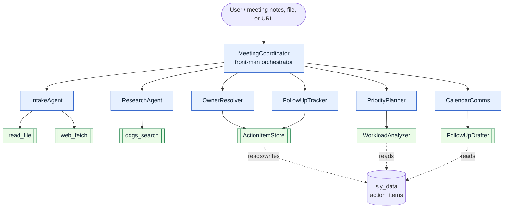
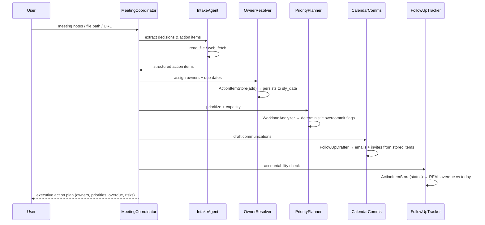

# Architecture — Meeting-to-Action Orchestrator

## 1. Overview

The Meeting-to-Action Orchestrator is a multi-agent system built on Cognizant's
[neuro-san](https://github.com/cognizant-ai-lab/neuro-san) framework. It converts
unstructured meeting content (notes, transcripts, files, or URLs) into a tracked,
prioritized, owner-assigned action plan, and then performs deterministic
follow-through — flagging what is genuinely overdue.

The agent network is defined declaratively in HOCON
([`registries/meeting_to_action_orchestrator.hocon`](registries/meeting_to_action_orchestrator.hocon))
and grounded in real Python tools
([`coded_tools/meeting_to_action_orchestrator/`](coded_tools/meeting_to_action_orchestrator)).

## 2. Agent topology

- **Agents** (LLM-driven): `MeetingCoordinator`, `IntakeAgent`, `OwnerResolver`,
  `PriorityPlanner`, `ResearchAgent`, `CalendarComms`, `FollowUpTracker`.
- **Toolbox tools** (provided by neuro-san-studio): `read_file`, `web_fetch`,
  `ddgs_search`.
- **Custom coded tools** (this project): `ActionItemStore`, `WorkloadAnalyzer`,
  `FollowUpDrafter`.

## 3. Coordination: the AAOSA protocol

Agents coordinate through neuro-san's **AAOSA** (Adaptive Agent Oriented Software
Architecture) protocol, whose shared instructions and call signature live in
[`registries/aaosa.hocon`](registries/aaosa.hocon). Each down-chain agent decides at
run time whether an inquiry (or part of it) belongs to it, states a claim strength,
and either asks for follow-up or fulfills its part. The `MeetingCoordinator` then
compiles the specialists' responses into one executive action plan. Routing is
decided by the agents at run time, not hard-coded.

## 4. End-to-end workflow

## 5. The evaluation loop (real, not simulated)

The core differentiator is a **deterministic evaluation loop**:

- `OwnerResolver` persists every finalized action item into neuro-san's out-of-band
  `sly_data` via `ActionItemStore(operation="add")`.
- `FollowUpTracker` later calls `ActionItemStore(operation="status")`, which compares
  each item's due date to **today's date in Python** and returns exact
  overdue / due-soon / missing-due-date buckets (with day counts).
- `PriorityPlanner` calls `WorkloadAnalyzer`, which counts open items per owner and
  flags overcommitment against fixed thresholds.

Because these are Python computations, the accountability findings are accurate and
reproducible rather than hallucinated.

## 6. State management with `sly_data`

Action items are stored in `sly_data["action_items"]`, neuro-san's out-of-band data
channel. This keeps structured task state separate from the chat stream and lets
multiple agents (`OwnerResolver`, `PriorityPlanner`, `CalendarComms`,
`FollowUpTracker`) share a single source of truth within a session.

## 7. LLM configuration

[`config/llm_config.hocon`](config/llm_config.hocon) defines a provider-agnostic
fallback chain. neuro-san automatically culls providers whose library or API key is
unavailable, so the same network runs on whichever key the operator provides:

1. Anthropic — `claude-sonnet-4-5` (default)
2. OpenAI — `gpt-4o`
3. Google Gemini — `gemini-2.0-flash`
4. Mistral — `mistral-medium-latest`

## 8. Runtime

The project runs on the neuro-san-studio runtime via `ns run`, which serves the
agent network (HTTP API on port 8080) and the **nsflow** graph UI (port 4173). The
`read_file` tool is access-controlled: the operator restricts it to the `sample_data`
directory and safe extensions in the HOCON, and the LLM cannot widen that scope.

## 9. Data & safety

All content is synthetic or user-provided. There is no real, client, or personally
identifiable data. In production, each coded tool maps cleanly onto a real
integration:

| Tool                      | Production equivalent                                |
| ------------------------- | ---------------------------------------------------- |
| `read_file` / `web_fetch` | Otter/Zoom transcript export, Confluence, SharePoint |
| `ActionItemStore`         | Jira / Asana / a task database                       |
| `WorkloadAnalyzer`        | Capacity data from the task system                   |
| `FollowUpDrafter`         | Outlook / Google Calendar + email APIs               |
| `ddgs_search`             | Enterprise search / knowledge base                   |

## 10. Extensibility

- Add a specialist agent (e.g. `RiskAssessor`) by adding a tool entry to the HOCON
  and listing it under `MeetingCoordinator`'s `tools`.
- Ground a coded tool for real by replacing the body of its `invoke()`.
- Swap or add LLM providers by editing the fallback chain in `llm_config.hocon`.
